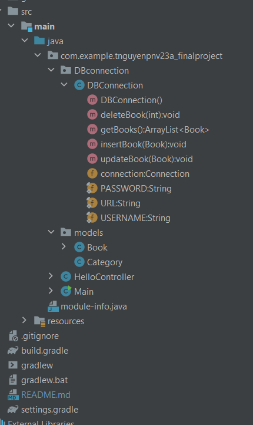
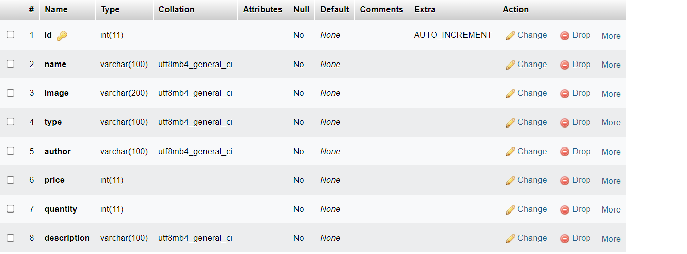

# Nguyen Thao Nguyen - PNV23A JavaFX

## Project Structure:

## Database Structure:

## Features:

### TO DO:

    Make a select option when create or update a book to choose type
    Make project by MVC Models

### Doing:

    Make button to change scene
    
### Done:

    Show all books in database
    Add a book
    Update a book
    Delete a book

## Link Video Demo: [Link](https://drive.google.com/drive/u/0/folders/1DkL_sHldaBQ1lI1s4UIiVhO2L_hJp1GD)
